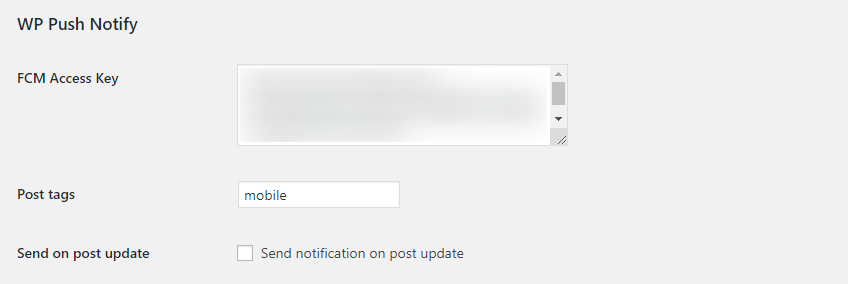

# WP Push Notify

> A simple WordPress plugin to send push notification via Firebase on post (Create/Update)

## ☁ Installation

Download zip and install from WordPress dashboard

## 🔧 Usage

Go to Dashboard Menu -> Settings -> Genetal

You should see a new section "WP Push Notify"

Enter the acces key from your Firebase application

Define multiple tags separated by comma to trigger push notification

Check "Send on post update" if you want alos notification on post update
